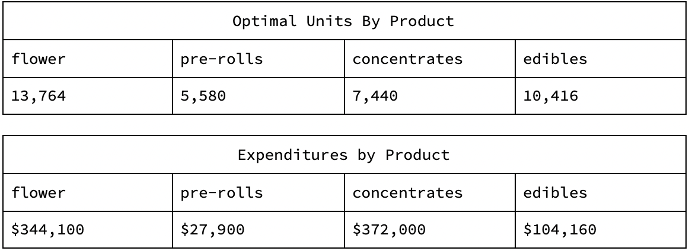

```{r setup, include=FALSE}
knitr::opts_chunk$set(echo = FALSE, warning = FALSE, message = FALSE, comment = "")
```

# Simulation and Optimization 

## ITAO 40150 • F2021

### University of Notre Dame • Mendoza College of Business 

**DATE: 07 October 2021**

**TO: Cloud Cannabis Company, Michigan, USA**

**COPY: Cloud Finance, Operations and Logistics, Human Resources**

**FROM: K. Cernugel, M. Goldschlager, E. Maxwell, Z. Peurach**

**SUBJECT: CLOUD PROJECT PROPOSAL MEMO**

**BACKGROUND.**
Michigan-based Cloud Cannabis Company currently operates 4 dispensaries and will soon open doors to its 5th in Detroit. The company faces intense competition and a rapidly-growing consumer base, trends matching the industry at large. In response, the client has approached the team with several business problems regarding merchandising, product strategy, logistics, demand variability, people operations, sales, production, and ROI. The team has collaborated on initial solutions to three components of the proposed engagement to inform ideation of Cloud’s optimal growth strategy. The results and abridged conclusions are below.

**APPROACH AND BUSINESS IMPLICATIONS.**
For its initial inquiry, the team selected the Stocking Shelves budgeting, Moving Product shipping rate, and Employees job preferences problems. Solidifying supplier relationships, budget allocations to maximize revenue, and departmental roles and responsibilities for onboarding new hires, are keys for a company looking to accelerate growth without falling into setbacks caused by internal operational conflicts.

**In approaching each problem, the team:**

* experimented with multiple optimization methods
* discussed risks associated with implementing each solution

*[1] STOCKING SHELVES.*

Cloud should stock their shelves with products based on maximizing revenue while meeting a cost constraint and producing to meet expected demand proportions for each product.  
RISKS: Cloud is relying on historical demand, if customer preferences suddenly shift the product mix may no longer be optimal.  
RESULTS: Cloud can maximize revenue at \$1,288,980 while spending \$848,160. The product mix and expenditure by product can be seen below.



```{r}
library(scales)

library(ROI)
library(ROI.plugin.lpsolve)
library(ROI.plugin.glpk)


products <- c("flower (3.5 grams)", "pre-rolls (1 gram)", 
                       "concentrates (1 gram)", "edibles (100 mg)")

costs <- c(25, 5, 50, 10)

demandProportions <- c(0.37, 0.15, 0.20, 0.28)

objectiveValues <- c(45, 12, 60, 15)

constraintValues <- c(850000, rep(0, 4))

zero_diag_matrix <- matrix(1,nrow=4,ncol=4) - diag(4)

demand_constraint_matrix <- (zero_diag_matrix * demandProportions * -1) + diag(4) * (1 - demandProportions)

constraintMatrix <- rbind(unlist(costs),
                         demand_constraint_matrix)

stockingShelvesOP <- OP(objective = objectiveValues, 
               constraints = L_constraint(L = constraintMatrix, 
                                          dir = c('<=', rep('==', 4)),
                                          rhs = constraintValues), 
                                          types = rep("I", 4),
                                          maximum = TRUE)

stockingShelvesOP_Result <- ROI_solve(stockingShelvesOP, solver = "lpsolve")

shelvingSolutionProduction <- data.frame(lapply(setNames(comma(stockingShelvesOP_Result$solution, accuracy = 1), products), type.convert),  
                                         stringsAsFactors=FALSE, check.names=FALSE)
shelvingSolutionRevenue <- data.frame(Revenue = dollar_format()(stockingShelvesOP_Result$objval))

shelvingSolutionExpenditures <- data.frame(lapply(setNames(dollar_format()(stockingShelvesOP_Result$solution * costs), products), type.convert),  
                                         stringsAsFactors=FALSE, check.names=FALSE)

shelvingSolutionPercentBudget <- data.frame(lapply(setNames(percent(sapply(stockingShelvesOP_Result$solution * costs, function(x){x/850000})), 
                                                            products), type.convert), 
                                            stringsAsFactors=FALSE, check.names=FALSE)

```

```{r}
knitr::kable(shelvingSolutionProduction, caption = "Optimal Units by Product")
knitr::kable(shelvingSolutionExpenditures, caption = "Expenditures by Product")
knitr::kable(shelvingSolutionRevenue)
```


*[2] MOVING PRODUCT.* 

Cloud should be selective when purchasing from its 4 suppliers. In order to minimize cost, Cloud should not purchase flower from all providers for every location. Instead, one or two suppliers should supply each location.  
RISKS: Although this creates risk (by having 1 or 2 suppliers supply each location, Cloud faces increased risk of receiving no product due to chance events), the cost savings associated likely outweigh these improbable challenges.  
RESULTS: In employing this strategy, Cloud also will not purchase from Rare Michigan Genetics. Because Cloud has three other suppliers, it does not need a relationship with Rare Michigan Genetics.  
As it grows, Cloud should consider purchasing from additional suppliers (not at the cost minimizing solution) to maintain wide relationships.

```{r}
library(linprog)

objective_values2 <- c(10, 8, 12, 20, 
                    10, 8, 12, 20, 
                    5, 10, 5, 25,
                    10, 8, 12, 20)
 
names(objective_values2) <- c("Better Provisioning, Ann Arbor", "Better Provisioning, Muskegon", 
                       "Better Provisioning, Utica", "Better Provisioning, Traverse City",
                       "Harbor Farmz, Ann Arbor", "Harbor Farmz, Muskegon", 
                       "Harbor Farmz, Utica", "Harbor Farmz, Traverse City",
                       "Hazy Farms, Ann Arbor", "Hazy Farms, Muskegon", 
                       "Hazy Farms, Utica", "Hazy Farms, Traverse City",
                       "Rare Michigan Genetics, Ann Arbor", "Rare Michigan Genetics, Muskegon", 
                       "Rare Michigan Genetics, Utica", "Rare Michigan Genetics, Traverse City")

constraint_values2 <- c(700, 300, 550, 420, 650, 200, 450, 250)

constraint_matrix2 <- rbind(c(1, 1, 1, 1, 0, 0, 0, 0, 0, 0, 0, 0, 0, 0, 0, 0), 
                            c(0, 0, 0, 0, 1, 1, 1, 1, 0, 0, 0, 0, 0, 0, 0, 0),
                            c(0, 0, 0, 0, 0, 0, 0, 0, 1, 1, 1, 1, 0, 0, 0, 0),
                            c(0, 0, 0, 0, 0, 0, 0, 0, 0, 0, 0, 0, 1, 1, 1, 1),
                            c(1, 0, 0, 0, 1, 0, 0, 0, 1, 0, 0, 0, 1, 0, 0, 0),
                            c(0, 1, 0, 0, 0, 1, 0, 0, 0, 1, 0, 0, 0, 1, 0, 0),
                            c(0, 0, 1, 0, 0, 0, 1, 0, 0, 0, 1, 0, 0, 0, 1, 0),
                            c(0, 0, 0, 1, 0, 0, 0, 1, 0, 0, 0, 1, 0, 0, 0, 1))

constraint_directions2 <- c(rep("<=",4), rep(">=",4))

solved_model2 <- solveLP(cvec = objective_values2, 
                        bvec = constraint_values2, 
                        Amat = constraint_matrix2, 
                        maximum = FALSE, 
                        const.dir = constraint_directions2, lpSolve = TRUE)

solved_model2$opt

lpSolveDF <- data.frame(solved_model2$solution)
lpSolveDF <- setNames(lpSolveDF, 'Flower')
```

```{r}
objectiveFunction <- c(10, 8, 12, 20, 
                    10, 8, 12, 20, 
                    5, 10, 5, 25,
                    10, 8, 12, 20)

names(objectiveFunction) <- c("Better Provisioning, Ann Arbor", "Better Provisioning, Muskegon", 
                       "Better Provisioning, Utica", "Better Provisioning, Traverse City",
                       "Harbor Farmz, Ann Arbor", "Harbor Farmz, Muskegon", 
                       "Harbor Farmz, Utica", "Harbor Farmz, Traverse City",
                       "Hazy Farms, Ann Arbor", "Hazy Farms, Muskegon", 
                       "Hazy Farms, Utica", "Hazy Farms, Traverse City",
                       "Rare Michigan Genetics, Ann Arbor", "Rare Michigan Genetics, Muskegon", 
                       "Rare Michigan Genetics, Utica", "Rare Michigan Genetics, Traverse City")

constraintValues <- c(700, 300, 550, 420, 650, 200, 450, 250)

constraintMatrix <- rbind(c(1, 1, 1, 1, 0, 0, 0, 0, 0, 0, 0, 0, 0, 0, 0, 0), 
                            c(0, 0, 0, 0, 1, 1, 1, 1, 0, 0, 0, 0, 0, 0, 0, 0),
                            c(0, 0, 0, 0, 0, 0, 0, 0, 1, 1, 1, 1, 0, 0, 0, 0),
                            c(0, 0, 0, 0, 0, 0, 0, 0, 0, 0, 0, 0, 1, 1, 1, 1),
                            c(1, 0, 0, 0, 1, 0, 0, 0, 1, 0, 0, 0, 1, 0, 0, 0),
                            c(0, 1, 0, 0, 0, 1, 0, 0, 0, 1, 0, 0, 0, 1, 0, 0),
                            c(0, 0, 1, 0, 0, 0, 1, 0, 0, 0, 1, 0, 0, 0, 1, 0),
                            c(0, 0, 0, 1, 0, 0, 0, 1, 0, 0, 0, 1, 0, 0, 0, 1))

constraintDirections <- c(rep("<=",4), rep(">=",4))

library(ROI)

library(ROI.plugin.glpk)

solved <- OP(objective = objectiveFunction, 
           constraints = L_constraint(L = constraintMatrix, 
                                      dir = constraintDirections, 
                                      rhs = constraintValues), 
           maximum = FALSE, types = (rep("I",length(objectiveFunction))))

result <- ROI_solve(solved)

glpkDF <- data.frame(solution(result))
glpkDF <- setNames(glpkDF, 'Flower')
```

<div class = "col2">
```{r}
knitr::kable(lpSolveDF, caption = paste("Shipping Flower- lpSolve Cost: ", solved_model2$opt))
```
</div>

*Shipping Continued*

<div class = "col2">
```{r}
knitr::kable(glpkDF, caption = paste("Shipping Flower- glpk Cost: ", result$objval))
```
</div>


*[3] EMPLOYEES.*

Cloud should assign employees to the departments where they help maximize the business’s overall preference scores. By this, we mean Cloud’s goal should be to assign as many employees as possible to their highest-scored departments, while having the ultimate goal of maximizing the preference scores for each department. Doing so will allow Cloud to maximize employee proficiency by assigning employees to departments they like and want to work in.

* RISKS: We are limited to what we know from the data provided to us for this problem. From this data, we do not know employees’ preferences of one another. For example, certain employees placed in the same department in our solution may not want to work together, leading to conflict in the workplace and decreased efficiency and productivity.

* RESULTS: The results of our analysis can be seen in the table below. These results provide the maximum preference scores for each department, thereby maximizing the score for the entire business. From this solution, every employee is placed into a department that they gave their maximum preference score.


Notes:

- 20 employees
- 4 departments
- 5 employees in each department


```{r}
library(tidyr)
library(ompr)
library(ompr.roi)
library(ROI.plugin.glpk)

job_preferences <- load("C:/Users/ellie/Documents/SENIOR YEAR/Simulation and Optimization/SimOps Group Project Files/job_preference_list.RData")

spread_data <- spread(job_preference, jobType, preference)

preference_data <- rownames(spread_data) <- spread_data$personName

preference_data <- spread_data[c("bud tending", "customer service", "marketing", "security")]

employees <- as.integer(nrow(spread_data))
departments <- 4
capacity <- rep.int(5, departments)

# Function to Pull Preferences of Each Employee/Row
weight <- function(employee, department) preference_data[employee, department]

model <- MIPModel() %>%
  # 1 if employee i is assigned to department j
  add_variable(x[i, j], i = 1:employees, j = 1:departments, type = "binary") %>%
  
  # maximize the preferences
  set_objective(sum_expr(weight(i, j) * x[i, j], i = 1:employees, j = 1:departments)) %>%
  
  # we cannot exceed the capacity of a department (5)
  add_constraint(sum_expr(x[i, j], i = 1:employees) <= capacity[j], j = 1:departments) %>% 
  
  # each employee needs to be assigned to one department
  add_constraint(sum_expr(x[i, j], j = 1:departments) == 1, i = 1:employees)

model

result <- solve_model(model, with_ROI(solver = "glpk"))

result <- get_solution(result, x[i, j])

result <- result[result$value == 1, c("i", "j")]

team_results <- dplyr::left_join(spread_data, result, by=c("personID"="i"))

team_results$department <- ifelse(team_results$j==1, "bud tending",
                       ifelse(team_results$j==2, "customer service",
                              ifelse(team_results$j==3, "marketing",
                                     "security")))

team_results <- team_results[,c("personName", "department")]
team_results <- team_results[order(team_results$department),]
```

<div class="col2">
```{r}
knitr::kable(team_results, row.names = F)
```
</div>


**ENGAGEMENT DECISION PROCESS.**
As a consulting firm, yes, we would take on this project, or a similar one. Even if the commercial cannabis sector lies outside the verticals of our usual engagements, the case presents opportunity for providing Cloud with a nuanced multi-part solution that will:

1. Bring our firm expertise decisioning in one of the fastest-growing industries (the cannabis industry is expected to grow at a 26.5% CAGR over 2021-2030, according to Globenewswire) that can be applied to other growing retail industries
2. Enhance our firm’s ability to win similar client projects in the future and open us to key referrals upon success
3. Challenge us to practically apply technical mathematics and statistics methods to higher-level strategy formulation

Some challenges in solving the initial three selected problem components included:

* Reaching multiple solutions due to using two different solvers (See: MOVING PRODUCT). Using Solve LP versus ROI results in two different solutions for each supplier and location. Though this can seem problematic, the team could collaborate with the client to determine their preferences on programming packages and utilize the objective numbers to inform a more general strategy, as needed.

* For the employees problem, our solution is limited by the data provided to us by Cloud. The dataset provided to us does not share information about employees’ preferences for working with one another. By not knowing if there are employees who refuse to work together, they may potentially be placed in the same department because it maximizes the preference scores of the overall business. However, this may lead to employee dissatisfaction and decreased productivity.

If similar problems arose with the full scope of work for this engagement or a similar one, the team would now be well-equipped to collaborate among themselves having gained experience or with the client team to advocate for more data shared and to reach a mutual understanding regarding how to proceed.
 
**KEY TEAM TAKEAWAYS**

*CERNUGEL.* My key takeaway from this project is to utilize the R documentation when stuck on a problem or confused about a concept. While working on my assigned problem, I ran into an issue of not being able to translate what I had written on paper into code. The R documentation for the package I was using helped me better understand the package conceptually and the arguments necessary in my code for my solution. The documentation proved to be an invaluable resource and contained helpful hints and examples for solving the problem. Although I have not used R documentation much in the past, I will certainly use it in the future when I need help. 

*GOLDSCHLAGER.* My main takeaway is that it is often beneficial to think of a problem as a math problem first. This enables you to better understand the constraints and then how those constraints can be programmed into a linear programming solver. Understanding what each constraint means and how they interact is important in order to properly model the problem and solve it.

*MAXWELL.* My main takeaway from this project was learning how to condense programming solutions into a narrative to share results in an “understandable” format useful for a client-facing setting. Communicating amongst my teammates was essential to assist them in clarifying the “ask” and closing any knowledge gaps, and to understand how each individual portion of the code interacted to inform the basis of a final recommendation. Both technical and interpersonal expertise must meet to bring a project to a confident close.

*PEURACH.* From this project, my key takeaway is that there is not one right answer to simulation and optimization questions. In my coursework, especially my math classes, I search for one right answer. This class helped me understand that complex problems have complex answers. In working on the “Moving Project” question, this was exemplified by different solutions produced by different solvers.

**CONCLUSION**

A simulation and optimization-focused project like this one grants our team the ability to integrate “storytelling” with simulation modeling and analysis to produce actionable recommendations for the client. We are confident our mix of technical expertise and client-facing confidence will allow us to help Cloud creatively optimize their operations and push them to more efficient and effective growth.
